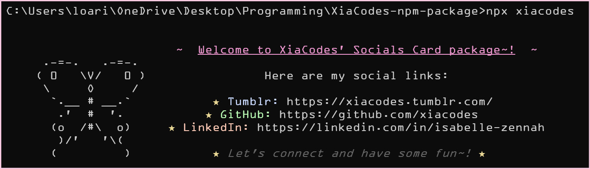

<h1 align=center>☆ XiaCodes npm Package ☆</h1>

I created my first npm package! This project was inspired by <a href="https://www.tumblr.com/kitkatcodes" target="_blank" >@kitkatcodes</a>' post on a tutorial she followed on creating npm packages, and I wanted to give it a go! It was really fun making it, and I'm thrilled to share my own npm package with you!

-----

## ☆ Project Journey

It took me around 3 hours to complete this project. Initially, I followed the tutorial mentioned by @kitkatcodes (which you can find here) to grasp the concept of creating an npm package. However, I couldn't resist adding my personal touch by playing around with colors and appearance, as I often do when coding. After some creative exploration, I finally completed the package and published it!

## ☆ Links
Here are some important links related to the project:

- My npm package page: [LINK](https://href.li/?https://www.npmjs.com/package/xiacodes-business-card)
- The ASCII art site: [LINK](https://href.li/?https://www.asciiart.eu/)
- The package to add colors to the output text: [LINK](https://href.li/?https://www.npmjs.com/package/chalk)

Feel free to explore these links and check out the various resources associated with the XiaCodes npm Package.

## ☆ Usage
To install the XiaCodes npm Package, you can follow these simple steps:
1. Open your terminal or command prompt.
2. Run the following command to install the package using npm: `npm i xiacodes-business-card`
3. Then type: `npx xiacodes`
4. Then view the output!

## ☆ Contact

If you have any questions, suggestions, or just want to connect, you can reach me via my blog <a href="https://xiacodes.tumblr.com/ask">The XiaCodes Blog</a>.

